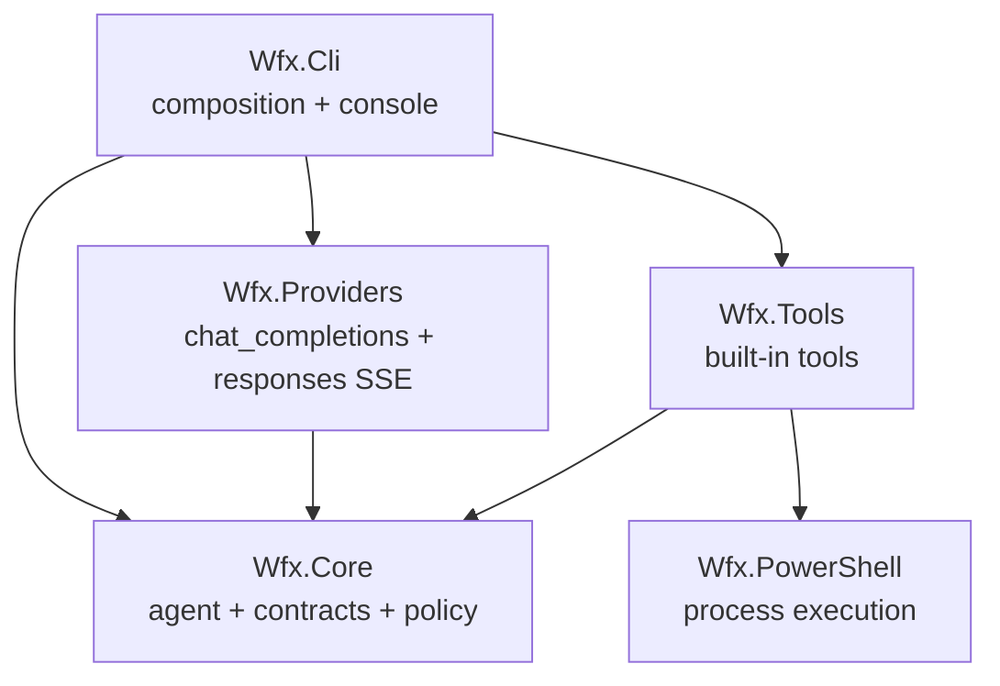
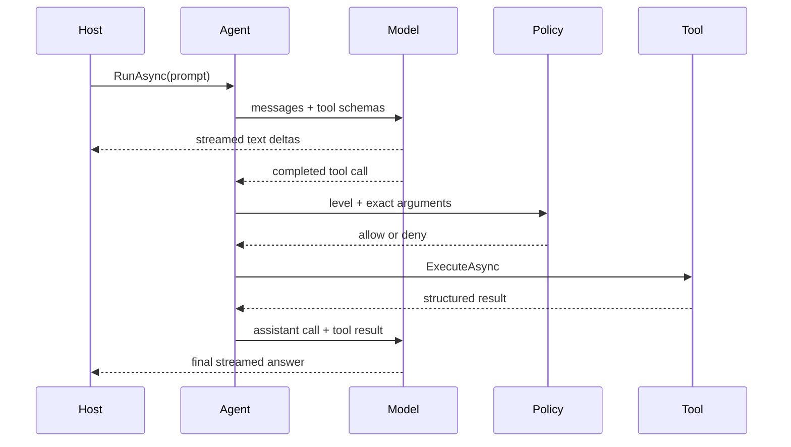

# Milestone 1 architecture

## Design goals

Milestone 1 proves one complete loop: discover a workspace and its instructions, stream a model response, execute structured tools under approval, append structured results, and continue until the model returns a final answer. The headless runtime remains independent from the CLI so editor, ACP, PowerShell module, and embedded SDK hosts can provide different I/O and policy later.

## Dependency direction

`Wfx.Core.Agent` owns explicit message state and iteration. `IModelProvider` yields text deltas and one completed assistant message. `ITool` exposes a model-facing JSON schema, computes an approval level from arguments, and executes with a cancellation token. `IApprovalService` makes the host—not the model—the authority for execution.

## Agent sequence

Denied execution is returned to the model as a structured failed tool result. It is never converted into authorization by model text.

## Workspace security

`WorkspacePathPolicy` establishes one absolute root. A candidate is checked twice:

1. lexical normalization with `Path.GetFullPath`, including a separator-aware root containment check;
2. link/junction resolution for every existing path segment, followed by containment against the resolved root.

Windows device and drive-relative paths are rejected. Recursive traversal does not enter reparse points. File tools revalidate paths immediately before access. This is defense in depth, not an OS sandbox; a future Windows sandbox/job-object layer can sit beneath the same tool contracts.

Child processes started by `ProcessExecutor` omit secret-bearing environment variables (`*_API_KEY`, `*_TOKEN`, `*_SECRET`, plus `WFX_API_KEY`, `OPENAI_API_KEY`, and `OPENROUTER_API_KEY`), then set `GIT_PAGER=cat` and `PAGER=cat`, then apply any caller overlay. `ChildProcessEnvironment` is the policy surface for those defaults. The `powershell` tool restores named parent variables only when `inherit_environment` is set.

## Provider boundary

The first provider targets `/chat/completions` with Server-Sent Events because it is supported by OpenAI, OpenRouter, LM Studio, Ollama compatibility mode, and many gateways. Serialization uses `Utf8JsonWriter`; response parsing uses `JsonDocument`. Incremental tool-call arguments are accumulated by tool index and validated as JSON before entering the agent loop.

Provider capability discovery is intentionally deferred. A later `ModelCapabilities` contract can describe tool calls, reasoning, image input, and endpoint-specific features without changing agent state ownership.

## Configuration

Configuration layers are parsed independently and merged in documented order. The effective settings object is immutable. Secrets may be read from configuration for compatibility, but environment variables are recommended and normal CLI output only reports whether credentials exist. As a trust-boundary exception to ordinary precedence, a workspace-level `base_url` does not inherit user or environment credentials/custom headers; hosts receive a warning when those values are suppressed.

Named profiles are settings layers stored under `profiles` in the user/project config files. A selected profile (`--profile` > `WFX_PROFILE` > `"profile"` key; project default over user default) expands in place into its file's layer, so the merge, suppression, and override semantics above apply unchanged. See [ADR 0001](adr/0001-profiles-are-named-settings-layers.md).

## Sessions

A session is an append-only JSONL event log owned by `Wfx.Core.SessionStore`, stored per user at `%USERPROFILE%\.wfx\sessions\<session-id>.jsonl`. The workspace is a field on the `header` event, not a path segment; a forced resume appends `workspace_rebound` so the binding changes without rewriting history. `SessionResume` coordinates session selection, workspace validation, endpoint restoration, and the lifetime of a session lease. `SessionStore` acquires that lease, persists the log, and repairs interrupted replay state while reading it. The agent loop does not know about persistence: `SessionRecorder` implements `IAgentObserver` and writes `turn_started`, `message`, `usage`, `interrupted`, and `error` events as they occur. `--no-session` skips creating a log. See [ADR 0002](adr/0002-sessions-are-append-only-event-logs.md), [ADR 0003](adr/0003-secrets-are-redacted-at-ingestion-not-at-persist.md), and [ADR 0004](adr/0004-provider-items-are-persisted-and-downgraded-on-rejection.md).

## Future seams

- MCP tools can implement `ITool` through an adapter.
- Skills can contribute context providers and tool bundles.
- Subagents can own isolated message lists while sharing a constrained tool registry and workspace policy.
- ACP can host `IAgent` and translate observer events.
- A PowerShell module can compose the same core without invoking CLI parsing.
